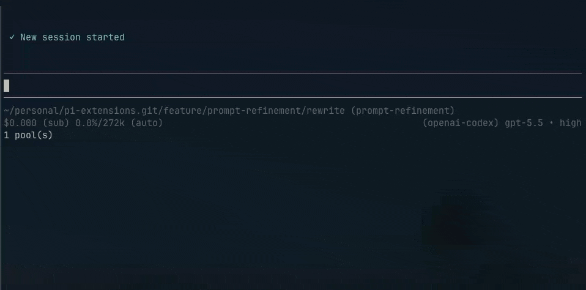

# Rewrite

Rewrites prompt text into a clearer, structured coding-agent prompt. The rewrite runs outside the main conversation, so the rewrite request and intermediate context don't pollute your chat or context window. The rewritten prompt is loaded into the editor for review before you send it. Trigger with `/rewrite <prompt text>`.



## Install

```bash
pi install npm:@petechu/pi-rewrite
/reload
```

## Usage

```text
/rewrite fix the flaky auth test and add coverage
```

### Workflow

1. **Start** — Type `/rewrite <prompt text>` to send your prompt for rewriting.
2. **Preview** — The model streams the revised prompt in a preview panel.
3. **Review and refine** — When complete, the rewritten prompt is loaded into the editor so you can edit it before sending.
4. **Repeat (optional)** — Add `/rewrite` at the start of the prompt to send it through another rewrite pass.

## Behavior

- Requires prompt text after `/rewrite`.
- Rejects prompt text that starts with `/` to avoid corrupting slash commands.
- Allows slash command references later in the prompt, for example:

  ```text
  /rewrite Design a plan, then use /handoff to document it
  ```

- Uses only the prompt text provided to `/rewrite`; it does not include conversation history.
- Runs the rewrite outside the main conversation, avoiding extra context-window pollution.
- Uses the current selected model and current thinking level when supported.
- Streams model output in a preview panel while rewriting.
- Loads the rewritten prompt into the editor when complete; it is not sent to the main conversation until you submit it.
- To re-rewrite, prefix the rewritten prompt with `/rewrite` and press Enter.

## Configuration

The extension reads `rewrite` settings from Pi's global agent settings and project `.pi/settings.json` (project overrides global):

```json
{
  "rewrite": {
    "instruction": "Rewrite as a terse senior-engineer implementation prompt with acceptance criteria."
  }
}
```

`rewrite.instruction` replaces the built-in rewrite style instruction, but fixed guardrails still apply: preserve intent, do not invent facts, and output only the rewritten prompt.

The built-in default instruction:

```text
Produce a prompt that a coding agent can act on without needing clarification.

- State the objective explicitly, even when the user only implied it.
- Surface implied acceptance criteria when they follow naturally from the request.
- Add placeholders for missing information that would block progress. When the gap is ambiguous, leave room for the agent to ask.
- Keep the result concise. Use structure (bullets, sections) when it makes the prompt easier to scan, not as decoration.
```

If `rewrite.instruction` is invalid, `/rewrite` warns and falls back to the built-in instruction.
